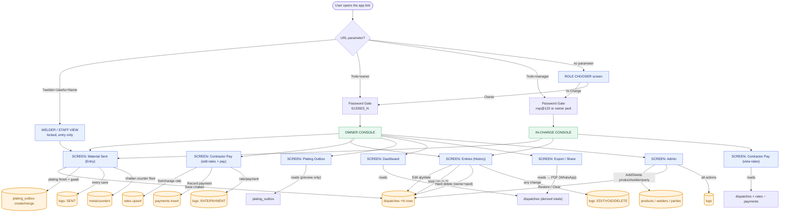
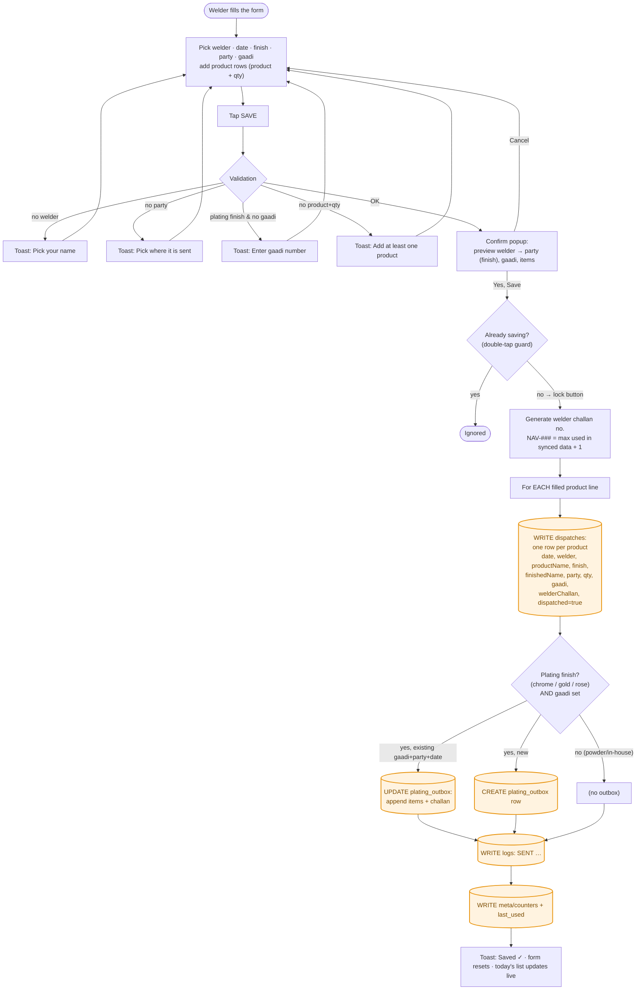
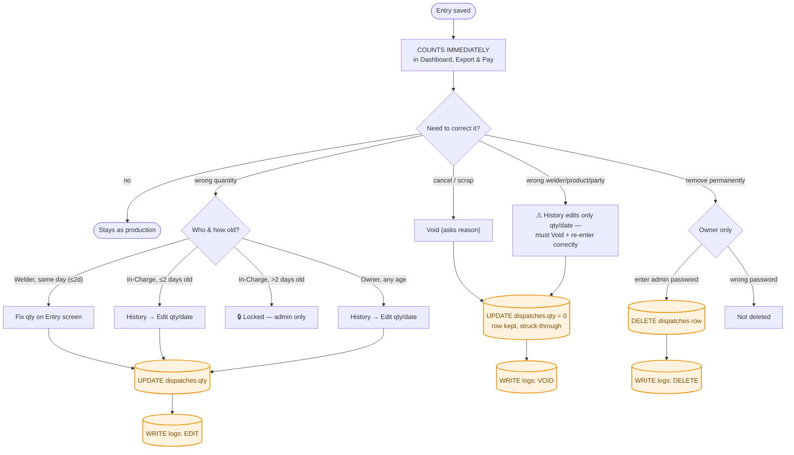
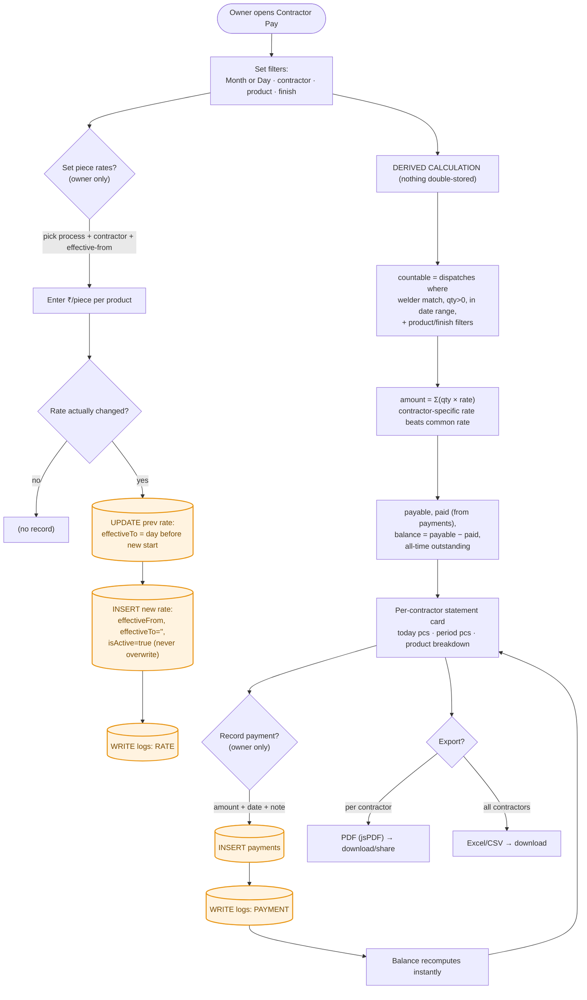
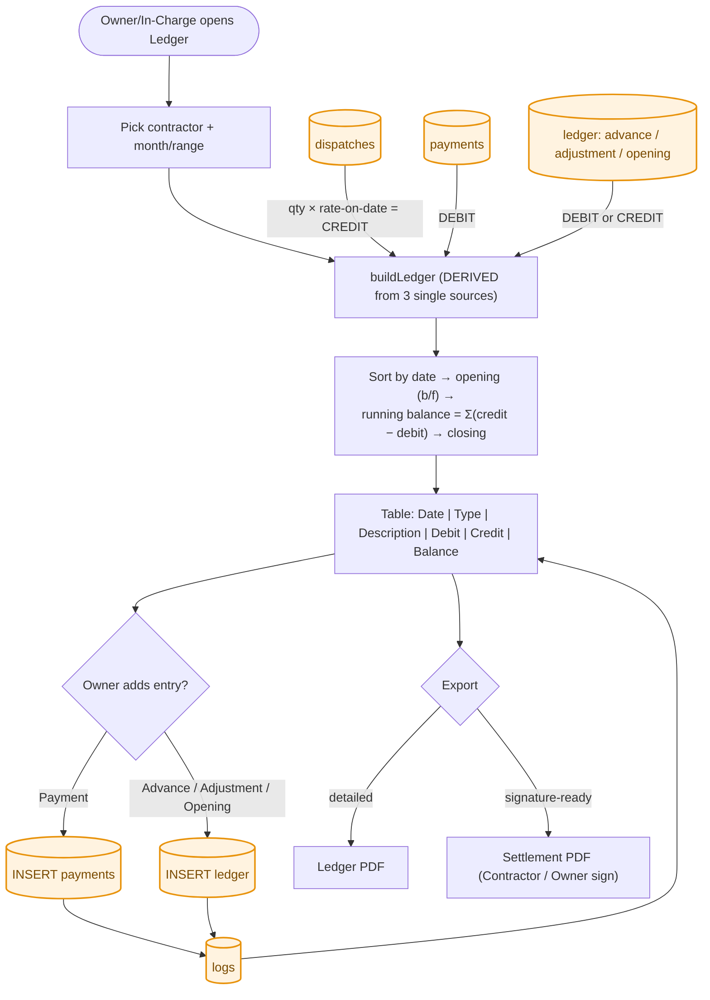
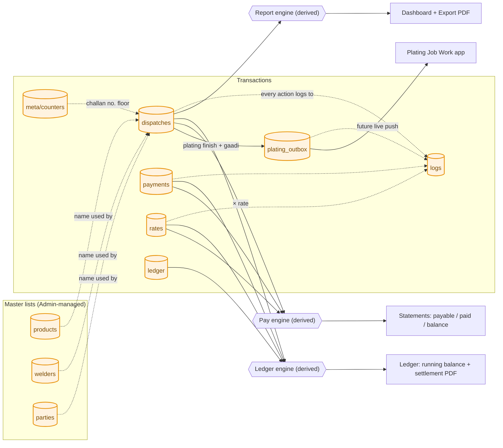
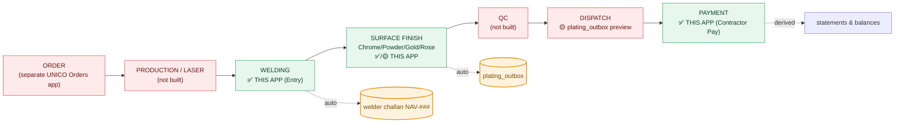

# UNICO Welder App — Complete Workflow Flowcharts (Mermaid)

> Every screen, action, database write, and approval/correction path, as the app
> behaves today (2026-06-07). Database writes are highlighted in **orange**.
> Firestore collections all live under `apps/welder/…`.
>
> Tip: GitHub, VS Code (with a Mermaid extension), and most markdown viewers
> render these automatically.

---

## 1. Master flow — entry → roles → screens → actions → DB writes

---

## 2. The Save action (Entry) — detailed automation & DB writes

---

## 3. Approval / correction path (current model — no approval gate)

> The old pending→passed→approved pipeline was removed. **Every saved entry
> counts immediately.** Corrections happen via Edit / Void / Hard-delete, all logged.

---

## 4. Contractor payment flow (Contractor Pay screen)

---

## 4b. Contractor Ledger flow (derived, audit-safe)

---

## 5. Database collections & data flow

---

## 6. Where this app sits in the factory pipeline

---

### Legend
- 🟧 **Orange `[( )]` nodes** = a Firestore write (`apps/welder/<collection>`).
- 🟦 **Blue** = a screen. 🟩 **Green** = a role/console or a built pipeline stage. 🟥 **Red** = not built yet.
- "Derived" = computed live from other collections, never stored twice (no double-counting).
- Reflects the codebase on **2026-06-07**, including Contractor Pay, crash-safe challan numbering, and the double-submit guard.
